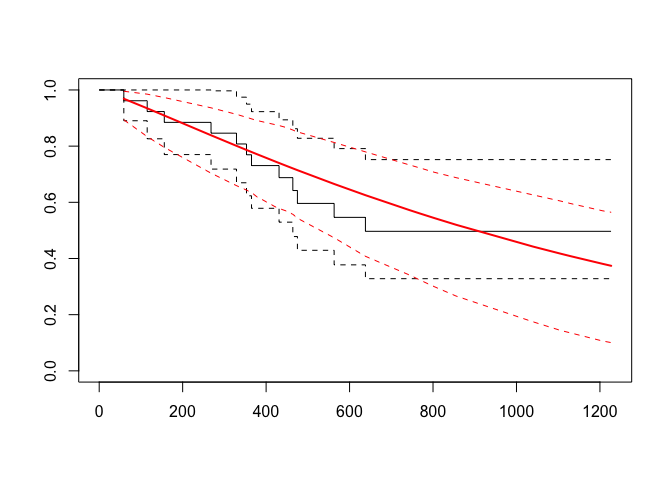
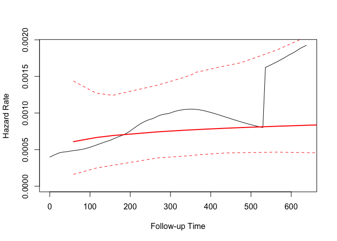

Accelerated failure time models
================
Nathan Constantine-Cooke
02 August, 2020

## Introduction

This document demonstrates how to construct an AFT Weibull model.

Two approaches will be presented. Firstly, via the the `survival`
package and secondly via the `flexsurv` package. We will once again be
using the cancer data-set from `survival`.

``` r
library(survival, quietly = TRUE)
library(flexsurv, quietly = TRUE)
```

## Via `survival`

As with Kaplan-Meier and Cox propotional hazards models, we use `Surv()`
to indicate the censoring/event time column and the censoring status
column. To create an AFT model, we use `survreg()`- specifying the
distribution via `dist`.

``` r
survregWeibull <- survreg(Surv(futime, fustat) ~ ecog.ps + rx,
                          ovarian,
                          dist = "weibull")
summary(survregWeibull)
```

    ## 
    ## Call:
    ## survreg(formula = Surv(futime, fustat) ~ ecog.ps + rx, data = ovarian, 
    ##     dist = "weibull")
    ##              Value Std. Error     z       p
    ## (Intercept)  6.897      1.178  5.86 4.7e-09
    ## ecog.ps     -0.385      0.527 -0.73    0.47
    ## rx           0.529      0.529  1.00    0.32
    ## Log(scale)  -0.123      0.252 -0.49    0.62
    ## 
    ## Scale= 0.884 
    ## 
    ## Weibull distribution
    ## Loglik(model)= -97.1   Loglik(intercept only)= -98
    ##  Chisq= 1.74 on 2 degrees of freedom, p= 0.42 
    ## Number of Newton-Raphson Iterations: 5 
    ## n= 26

Exponentiating our coefficients gives us results with a real-world
interpretation. For instance, patients taking the non-reference
medication could be expected to live 1.7 times longer than if they were
taking the reference medication.

``` r
exp(coef(survregWeibull))
```

    ## (Intercept)     ecog.ps          rx 
    ## 988.9988102   0.6804217   1.6966327

We can also calculate the value of the shape parameter.

``` r
shapeParameter <- 1 / survregWeibull$scale
shapeParameter
```

    ## [1] 1.131384

Note\! `survival` has built-in support for the “weibull”, “exponential”,
“gaussian”, “logistic”,“lognormal” and "loglogistic distributions.

## Via `flexsurv`

The `flexsurv` package, in my opinion, offers much more utility for AFTs
than `survival`. In addition to supporting all of the same distributions
as `survival` (and more), `flexsurv` supports `plot()`.

``` r
sWei  <- flexsurvreg(Surv(futime, fustat) ~ rx + ecog.ps,
                     dist = 'weibull',
                     data=ovarian)
plot(sWei)
```

<!-- -->

We can also plot the hazard function (or the cumulative hazard if we so
wish) by specifying the `type` argument when using `plot()`

``` r
plot(sWei, type = "hazard")
```

<!-- -->

``` r
(sWei)
```

    ## Call:
    ## flexsurvreg(formula = Surv(futime, fustat) ~ rx + ecog.ps, data = ovarian, 
    ##     dist = "weibull")
    ## 
    ## Estimates: 
    ##          data mean  est       L95%      U95%      se        exp(est)  L95%    
    ## shape          NA      1.131     0.690     1.855     0.285        NA        NA
    ## scale          NA    988.999    98.371  9943.185  1164.592        NA        NA
    ## rx          1.500      0.529    -0.509     1.566     0.529     1.697     0.601
    ## ecog.ps     1.462     -0.385    -1.418     0.648     0.527     0.680     0.242
    ##          U95%    
    ## shape          NA
    ## scale          NA
    ## rx          4.787
    ## ecog.ps     1.911
    ## 
    ## N = 26,  Events: 12,  Censored: 14
    ## Total time at risk: 15588
    ## Log-likelihood = -97.08449, df = 4
    ## AIC = 202.169
