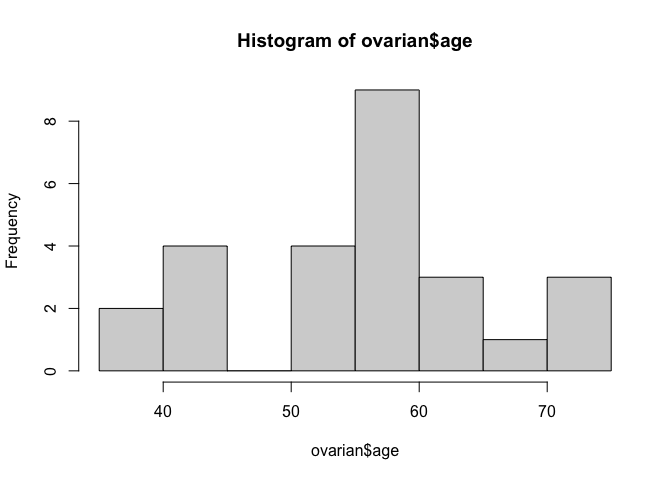
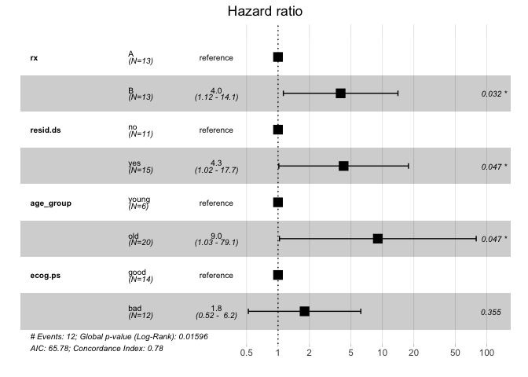
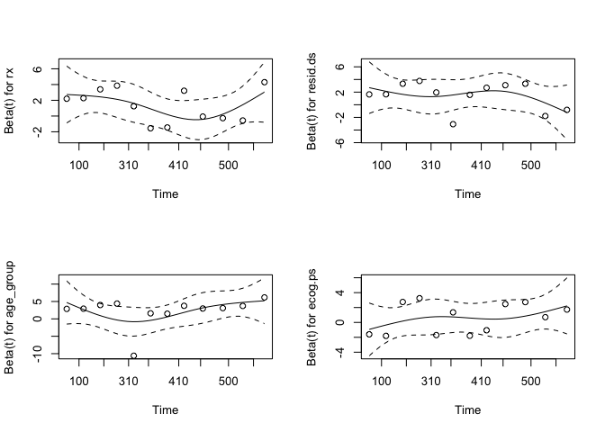
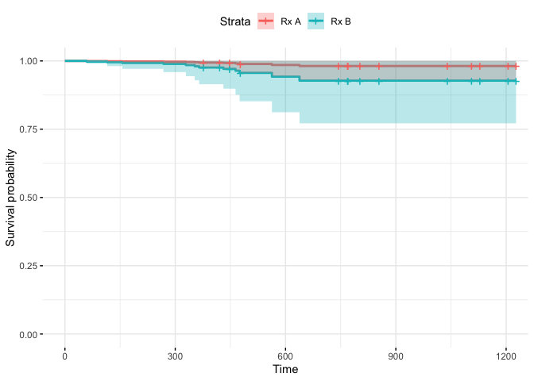

Cox proportional hazards
================
Nathan Constantine-Cooke
02 August, 2020

## Introduction

This document demonstrates how to construct a Cox proportional hazards
model, assess the output, test for violations of the proportional
hazards assumption, and how to assess discriminative ability/ predictive
accuracy

We will be using the `survival` package to construct the Cox model and
for it’s included `ovarian` data-set. We will be using the `survminer`
package for visualisation purposes.

``` r
library(survival, quietly = TRUE )
library(survminer, quietly = TRUE)
library(dplyr, warn.conflicts = FALSE)
```

The `ovarian` data-set has been produced from a randomised trial which
compared two treatments for ovarian cancer. `futime` denotes the
survival/ censoring time, `fustat` indicates censoring status, `rx`
indicates treatment group.

``` r
data("ovarian")
knitr::kable(head(ovarian))
```

| futime | fustat |     age | resid.ds | rx | ecog.ps |
| -----: | -----: | ------: | -------: | -: | ------: |
|     59 |      1 | 72.3315 |        2 |  1 |       1 |
|    115 |      1 | 74.4932 |        2 |  1 |       1 |
|    156 |      1 | 66.4658 |        2 |  1 |       2 |
|    421 |      0 | 53.3644 |        2 |  2 |       1 |
|    431 |      1 | 50.3397 |        2 |  1 |       1 |
|    448 |      0 | 56.4301 |        1 |  1 |       2 |

## Constructing a Cox proportional hazards model

We will dichotomise age. We also acknowledge that we expect older
patients to have worse outcomes, so will set young age as the first
level, (I.E the reference). Inspecting a histogram of age suggests age
\(\geq\) 50 is a natural cutoff.

``` r
hist(ovarian$age)
```

<!-- -->

``` r
ovarian <- ovarian %>% dplyr::mutate(age_group = ifelse(age < 50, "young",
                                                        "old"))
ovarian$age_group <- factor(ovarian$age_group, levels = c("young", "old"))
```

Note that covariates do not need to be discrete but it is easier to
assess PH assumption if they are.

Similarly, we will reorder the levels of factors to ensure HR \> 1

``` r
ovarian$rx <- factor(ovarian$rx, levels = c(2, 1), labels = c("A", "B"))

ovarian$resid.ds <- factor(ovarian$resid.ds,  levels = c("1", "2"), 
                           labels = c("no", "yes"))

ovarian$ecog.ps <- factor(ovarian$ecog.ps,levels = c("1", "2"), 
                          labels = c("good", "bad"))
```

We create a Cox proportional hazards object in `survival` by first
creating a `Surv` object and passing this to the `coxph` function as
part of a formula.

``` r
fit.coxph <- coxph(Surv(time = futime, event = fustat) ~
                     rx + resid.ds + age_group + ecog.ps, 
                   data = ovarian)
```

## Assessing output

The summary of the Cox object gives us many of the parameters we
discussed in the slides. The `coef` column gives us the estimates for
each \(\beta_i\)s. The exponential of this coefficient will give us the
HR for the exposure, adjusted for the other parameters. The Z column
gives us Wald test statistics given by
\(z = \frac{\beta_i}{se(\beta_i)}\).

``` r
summary(fit.coxph)
```

    ## Call:
    ## coxph(formula = Surv(time = futime, event = fustat) ~ rx + resid.ds + 
    ##     age_group + ecog.ps, data = ovarian)
    ## 
    ##   n= 26, number of events= 12 
    ## 
    ##                coef exp(coef) se(coef)     z Pr(>|z|)  
    ## rxB          1.3814    3.9803   0.6448 2.142   0.0322 *
    ## resid.dsyes  1.4470    4.2503   0.7292 1.984   0.0472 *
    ## age_groupold 2.2013    9.0368   1.1069 1.989   0.0467 *
    ## ecog.psbad   0.5859    1.7966   0.6329 0.926   0.3546  
    ## ---
    ## Signif. codes:  0 '***' 0.001 '**' 0.01 '*' 0.05 '.' 0.1 ' ' 1
    ## 
    ##              exp(coef) exp(-coef) lower .95 upper .95
    ## rxB              3.980     0.2512    1.1248    14.085
    ## resid.dsyes      4.250     0.2353    1.0180    17.745
    ## age_groupold     9.037     0.1107    1.0324    79.103
    ## ecog.psbad       1.797     0.5566    0.5197     6.211
    ## 
    ## Concordance= 0.782  (se = 0.065 )
    ## Likelihood ratio test= 12.19  on 4 df,   p=0.02
    ## Wald test            = 9.02  on 4 df,   p=0.06
    ## Score (logrank) test = 11.97  on 4 df,   p=0.02

We are also given 95% confidence intervals for the HRs. A basic sanity
check shows these confidence intervals are generated as previously
presented.

``` r
cat("Lower CI for Beta_1 is", exp(1.3814  - 1.96 * 0.6448))
```

    ## Lower CI for Beta_1 is 1.124785

Finally we have some statistics for the overall model. Concordance is a
measure of performance and can be interpreted as the fraction of all
pairs of subjects whose predicted survival times are correctly ordered
among all subjects that can be ordered. This is equivalent to AUC.

It is very common to visualise hazard ratios and their confidence
intervals using forest plots. This can easily be generated using
`survminer::ggforest()`.

``` r
ggforest(fit.coxph, data = ovarian)
```

<!-- -->

## Testing the proportional hazards assumption

The proportional hazards assumption can be tested via Schoenfeld
residuals.

A Schoenfeld residual is defined by an observed value of \(x_i\) for a
subject minus a weighted average of the \(X_i\)s for the other subjects
still at risk at time \(t\) where \(t\) is the time of event. The
weights are each subject’s hazard. A Wald test statistic is found which
results in a chi-square distribution with one degree of freedom.

``` r
ph.assumption <- cox.zph(fit.coxph)
print(ph.assumption)
```

    ##           chisq df    p
    ## rx         1.11  1 0.29
    ## resid.ds   1.51  1 0.22
    ## age_group  1.06  1 0.30
    ## ecog.ps    2.15  1 0.14
    ## GLOBAL     5.31  4 0.26

You can also plot the residuals. If the residuals follow a pattern with
time, then this is evidence for the proportional hazards assumption
being violated.

``` r
par(mfrow = c(2, 2)) 
plot(ph.assumption)
```

<!-- -->

## Survival curves

We may also wish to draw survival curves, stratified by a covariate,
such as `Rx` adjusted for the other variables. In this case we need to
first construct a dataframe with as many rows as we want curves. Each
column will represent the status of the covariate. For the covariate of
interest, we will vary the levels. All other covariates should use the
reference level if a factor or the mean value if continuous.

``` r
rx.df <- with(ovarian,
               data.frame(rx = c("A", "B"),
                          age_group = c("young", "young"),
                          resid.ds = c("no", "no"),
                          ecog.ps = c ("good", "good")
                          )
               )
```

We can then plot the curves using `ggsurvplot()`. As can be seen in the
plot, there is a high degree of overlap for the confidence intervals
which can be attributed to the low sample size.

``` r
fit <- survfit(fit.coxph, newdata = rx.df)
ggsurvplot(fit, conf.int = TRUE, data = "rx.df",
           legend.labs=c("Rx A", "Rx B"),
           ggtheme = theme_minimal())
```

<!-- -->
