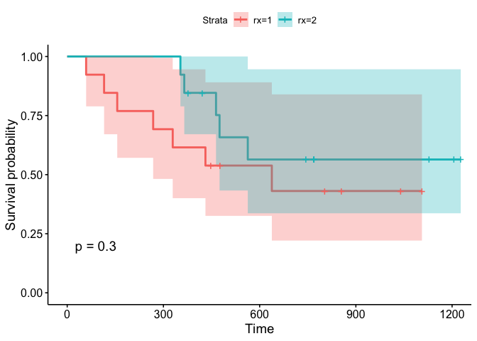

Kaplan-Meier
================
Nathan Constantine-Cooke
02 August, 2020

## Introduction

This document demonstrates how to use the Kaplan-Meier method with R.

We will be using the `survival` package to calculate the Kaplan-Meier
statistic and for its included `ovarian` data-set. We will be using the
`survminer` package for visualisation purposes.

``` r
library(survival, quietly = TRUE )
library(survminer, quietly = TRUE)
library(dplyr, warn.conflicts = FALSE)
```

The `ovarian` data-set has been produced from a randomised trial which
compared two treatments for ovarian cancer. `futime` denotes the
survival/ censoring time, `fustat` indicates censoring status, `rx`
indicates treatment group.

``` r
data("ovarian")
knitr::kable(head(ovarian))
```

| futime | fustat |     age | resid.ds | rx | ecog.ps |
| -----: | -----: | ------: | -------: | -: | ------: |
|     59 |      1 | 72.3315 |        2 |  1 |       1 |
|    115 |      1 | 74.4932 |        2 |  1 |       1 |
|    156 |      1 | 66.4658 |        2 |  1 |       2 |
|    421 |      0 | 53.3644 |        2 |  2 |       1 |
|    431 |      1 | 50.3397 |        2 |  1 |       1 |
|    448 |      0 | 56.4301 |        1 |  1 |       2 |

## Kaplan-Meier Survival Curve

We create a Cox proportional hazards object in `survival` by first
creating a `Surv()` object which is where we define which column
indicates survival/ censoring time, and which column indicates censoring
status.

``` r
surv_object <- Surv(time = ovarian$futime, event = ovarian$fustat)
```

We then use `survfit()` to fit a Kaplan-Meier curve. When we do not wish
to stratify, we specify `surv_object ~ 1` where `surv_object`is the
object created by the `Surv()` function. Finally we use the `ggsurvplot`
function to plot our curve.

``` r
fit1 <- survfit(surv_object ~ 1, data = ovarian)
ggsurvplot(fit1, data = ovarian)
```

<!-- -->

## Stratified Kaplan-Meier

When we wish to perform plot Kaplan-Meier curves stratified by groups,
we simply use `~ GROUP_NAME` instead of `~ 1` for `survfit` where
`GROUP_NAME` is the name of the factor we are stratifying by. In the
below example, we stratify by the drug given to the patients. By setting
`pval = TRUE`, we are given the p-value from performing a log-rank test.
I also recommend setting `conf.int = TRUE` to plot the confidence
intervals for each curve.

``` r
fit2 <- survfit(surv_object ~ rx, data = ovarian)
ggsurvplot(fit2, data = ovarian, pval = TRUE, conf.int = TRUE)
```

<!-- -->
